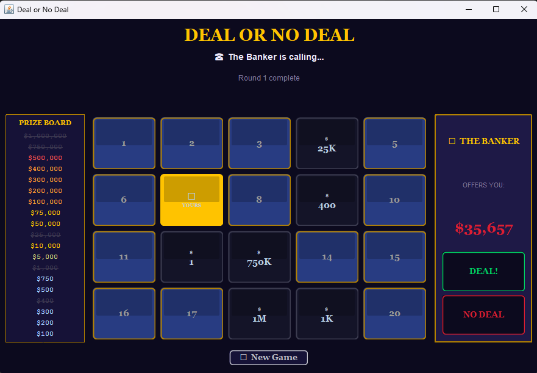
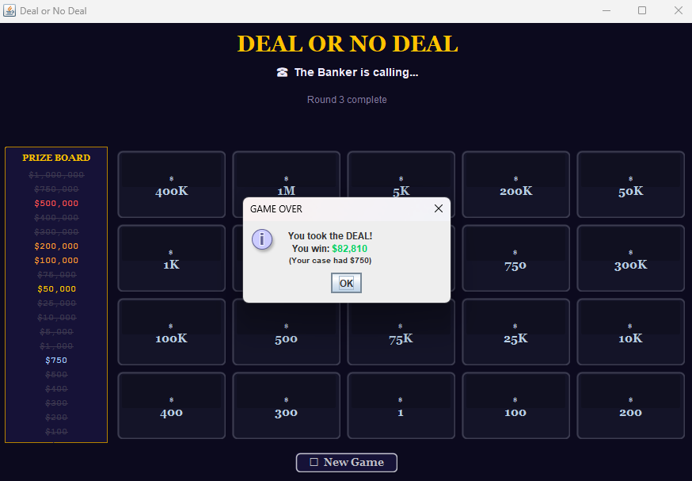

# Deal or No Deal — Java Assignment

A fully playable Deal or No Deal game built in Java using Swing.
All game logic and both frontends are contained in a single file: `DealNoDeal.java`.

**Frontend:** `DealNoDealFrame` (JFrame) and `DealNoDealApplet` (JApplet)  
**Backend:** `DealNoDealGame` — handles cases, rounds, and banker offer calculations

## How to Run
```
javac DealNoDeal.java
java DealNoDeal
```


